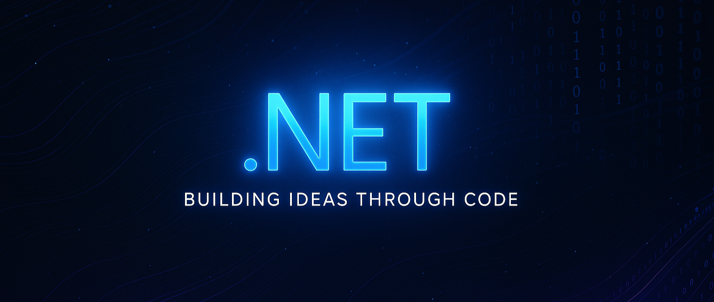

# 👋 ¡Hola! Soy Gyursel Mustan Mustafa

🚀 Software Developer | C# · .NET · Swift · Python · Java

💻 Soy un desarrollador de software apasionado por crear soluciones multiplataforma y optimizar procesos.
Disfruto trabajar con tecnologías modernas como .NET MAUI, Swift, Python y JavaScript, aplicando principios SOLID y arquitecturas limpias.
Me motiva aprender, experimentar con nuevas herramientas y construir proyectos con impacto real.

---

## 🧩 Proyectos destacados

### ⚙️ [WindowsServiceFTP](https://github.com/GyurselM/WindowsServiceFTP) 

Servicio de Windows desarrollado en C# que transfiere archivos entre servidores mediante SFTP, con registro de logs personalizados y despliegue automatizado con Docker y Azure DevOps.

>  📦 Tecnologías: C# · .NET Core · SFTP · SQL Server · Docker · Azure DevOps
    
---

### 🎯 [TarjetaFidelizacion](https://github.com/JavierGonzalezMartos/TarjetaFidelizacion) 

Aplicación de gestión de clientes y puntos de fidelización, desarrollada en .NET MAUI. Cuenta con validación de datos, arquitectura MVVM, y conexión local con SQL Server.

>  🧱 Tecnologías: .NET MAUI · C# · MVVM · SQL Server

---

### 🎮 [TFG-InTheBreak](https://github.com/GyurselM/TFG-InTheBreak) 

Proyecto de videojuego 2D en Unity. Participé en la programación de la lógica del juego, diseño de assets y revisión del código del equipo.

>  🕹️ Tecnologías: Unity · C# · UML

---

### 🧠 [iOS Memory Game](https://github.com/GyurselM/iOS) 

Pequeño juego de memoria creado para iOS, donde el usuario debe recordar la posición de las cartas. Fue mi primer acercamiento al desarrollo en Swift, centrado en la lógica del juego y la interfaz intuitiva.

>  🎮 Tecnologías: Swift · UIKit · Xcode

---

### 🏋️ [Fitness App](https://github.com/GyurselM/fitness) 

Aplicación web para calcular las calorías diarias y generar dietas personalizadas según tus objetivos.

>  💪 Tecnologías: JavaScript · HTML · CSS

---

## 📊 Estadísticas

---

## 🌱 Actualmente

- Aprendiendo y profundizando en el ecosistema **.NET**

- Mejorando mis conocimientos en **C#** y arquitectura de aplicaciones

- Desarrollando nuevos proyectos personales para seguir practicando y creciendo como desarrollador 🚀

---

## 📫 Contacto

📍 Madrid, España

📧 mustan17gursel@gmail.com

💼 [LinkedIn – Gyursel Mustan Mustafa](https://www.linkedin.com/in/gyursel-mustan-mustafa-18a457185)

---

> 💡 “El código es el arte de convertir ideas en realidad.”

